# WWIIHexV0 Mermaid 核心流程图

> 本图参照 `md/flow/flow.md`。每个图块都用“中文解释 + 关键代码名”标注：先看中文理解逻辑，再用代码名回到源码定位。

## 0. 读图总纲

项目当前最重要的逻辑是：

```text
地图编辑器/JSON 数据
  -> 游戏启动加载为 GameState
  -> hex 是真实战术权威
  -> region / theater / front / deploy 都是从 hex 和单位位置派生出来的战略层
  -> economy 是 faction 级经济总账，收入仍从真实控制的 hex/region 聚合
  -> v0.5 元帅层是战略意图层，不替代战术权威
  -> 玩家和 AI 都必须把命令交给 RuleEngine
  -> 命令执行后再同步刷新战略层和 UI
```

图里颜色含义：

- 红色：权威状态，不能被下游反向覆盖。
- 绿色：派生状态，可以重建，但来源必须清楚。
- 蓝色：初始快照/基准状态，不是运行时推进状态。
- 紫色：命令管线，玩家、AI、未来聊天命令都要走这里。

## 0.1 云端协作与结果包验收

这张图只描述协作和验证闭环，不改变游戏运行时业务逻辑。当前默认只使用 `main` 直推，不使用 `smalldata_test`、`develop`、`codeb/...`、候选分支或 PR 合并流。

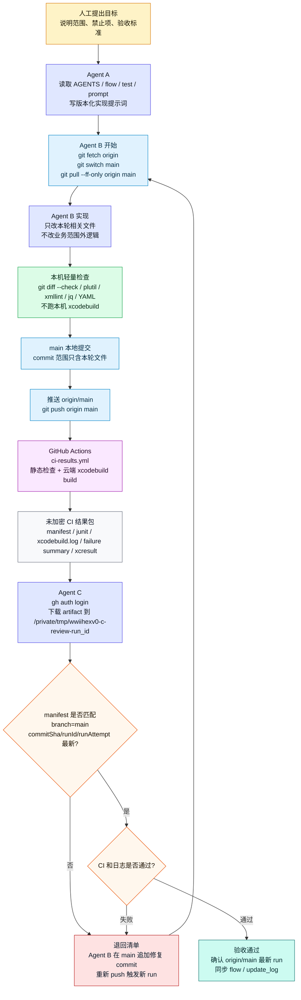

## 0.2 v6.0 现代战争迁移兼容层

这张图描述当前 v6.0 已落地的显示兼容层。它只改变玩家可见术语，不改变 JSON raw value、命令管线、战斗规则或默认剧本。

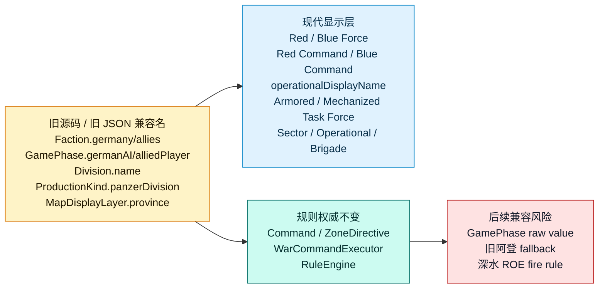

## 0.3 v6.1 作战方与 ROE 兼容层

这张图描述当前 v6.1 第一批实现。它让现代作战方、neutral fallback 和最小 ROE helper 进入底层，但还没有切换默认现代剧本。

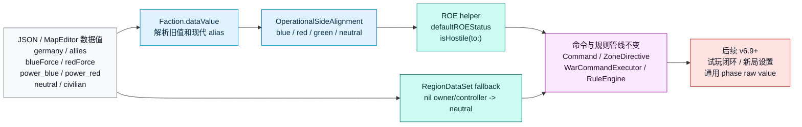

## 0.4 v6.2 灰潮行动默认剧本种子

这张图描述当前 v6.2 第一批实现。默认新局优先加载现代剧本种子，旧阿登资源只保留作 fallback / 历史兼容。

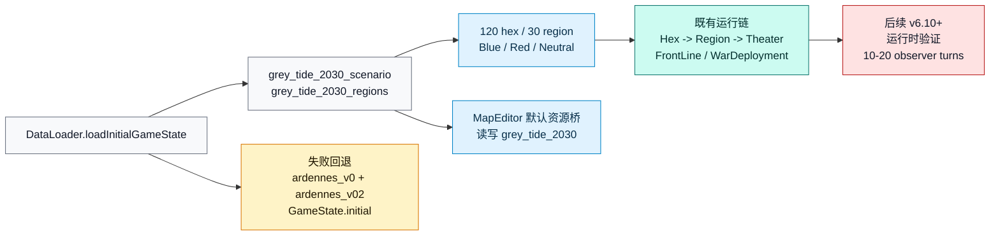

## 0.5 v6.3 现代单位、移动、战斗和后勤基础

这张图描述当前 v6.3 第一批实现。默认现代剧本使用现代合成作战模板；旧阿登数据集仍固定使用 legacy 模板，避免旧测试和 fallback 语义被现代模板覆盖。

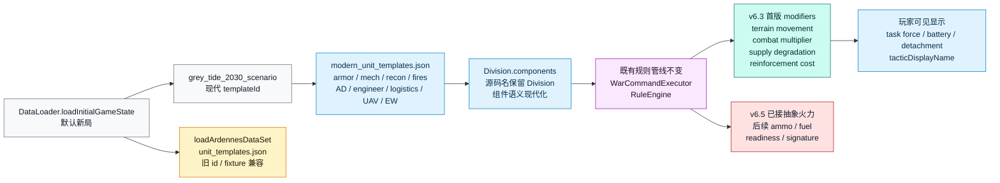

## 0.6 v6.4 ISR、ContactTrack 和电子战基础

这张图描述当前 v6.4 第一批实现。它让 AI/UI 读取 contact 摘要而不读取真实敌军列表；真实 `linkedDivisionId` 只在规则层内部用于把 medium+ contact 解析成可攻击目标。

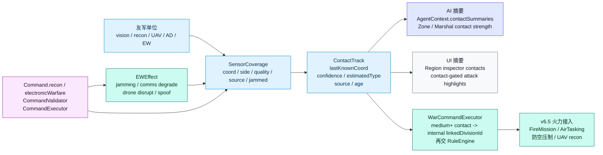

## 0.7 v6.5 精确火力、空地协同、无人系统和防空抽象

这张图描述当前 v6.5 第一批实现。火力和空中任务只通过 `Command` 进入规则系统；FireSupport 不占领 hex，只影响 damage、retreat、contact quality、AD suppression 和日志。

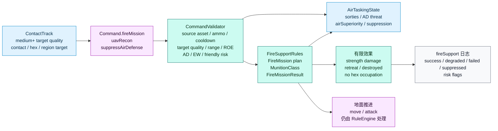

## 0.8 v6.6 现代 AI Agent 指挥链和审计复盘

这张图描述当前 v6.6 第一批实现。现代指挥链只作为 advisory JSON 和复盘层接入，不直接执行 sub-directive；最终行动仍回到 `ZoneDirective -> WarCommandExecutor -> RuleEngine`。

```mermaid
flowchart LR
    MARSHAL["MarshalAgent<br/>Battlefield summary<br/>Operational Directive JSON"]:::agent
    TDEC["TheaterDirectiveDecoder<br/>schema / issuer / turn / faction<br/>zone / region / tactic"]:::rules
    ORCH["ModernCommandChainOrchestrator<br/>National / Joint / Chief<br/>ISR / Fires / Air / EW / Logistics / Brigade"]:::agent
    CJSON["ModernCommandChainPlan JSON<br/>StrategicConstraintEnvelope<br/>JointCommandPlan<br/>ModernSubDirective"]:::data
    CDEC["ModernCommandChainDecoder<br/>nested schema / role<br/>zone / region / contact / mission"]:::rules
    FAIL["失败只写 diagnostics<br/>不执行半成品"]:::stop
    COMP["TheaterDirectiveCompiler<br/>编译 ZoneDirective"]:::command
    EXEC["WarCommandExecutor<br/>RuleEngine"]:::rules
    RECORD["AgentDecisionRecord<br/>rawJSON + commandChainReplayItems<br/>raw invalid JSON retained when available"]:::display
    PANEL["AgentPanelView<br/>role / mission / priority<br/>target / rationale / diagnostics"]:::display

    MARSHAL --> TDEC --> ORCH --> CJSON --> CDEC
    CDEC -->|通过| COMP --> EXEC
    CDEC -->|失败| FAIL
    TDEC --> COMP
    CJSON --> RECORD
    COMP --> RECORD
    EXEC --> RECORD
    RECORD --> PANEL

    classDef agent fill:#e0e7ff,stroke:#4f46e5,color:#111827
    classDef data fill:#f8f9fb,stroke:#6b7280,color:#111827
    classDef rules fill:#ccfbf1,stroke:#0f766e,color:#052e16
    classDef command fill:#fae8ff,stroke:#a21caf,color:#2a0a2f
    classDef display fill:#f8f9fb,stroke:#6b7280,color:#111827
    classDef stop fill:#fee2e2,stroke:#b91c1c,color:#111827
```

## 0.9 v6.7 玩家现代指挥 UI 和任务计划

这张图描述当前 v6.7 第一批实现。玩家通过任务面板发起现代任务，但 SwiftUI 只调用 `AppContainer`，最终仍进入 `Command` / `ZoneDirective` 与规则系统。

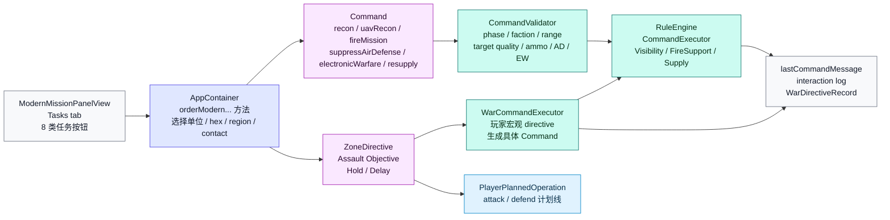

## 0.10 v6.8 现代 C2 状态 UI 和地图态势 overlay

这张图描述当前 v6.8 第一批实现。它只从既有 `GameState` 读取态势并绘制 UI，不新增执行器，也不绕过 `Command` / `RuleEngine`。

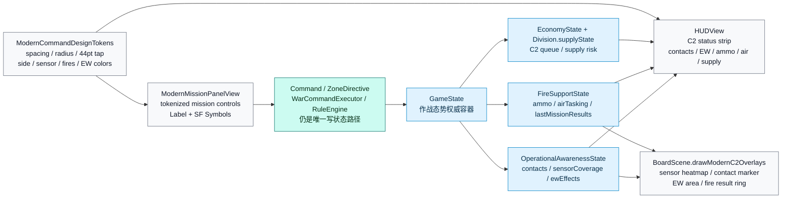

## 0.11 v6.9-v6.10 新局、继续和试玩闭环

这张图描述当前 v6.9-v6.10 试玩闭环。Playtest 面板只调用 `AppContainer`，红/蓝新局选择、本地快照和地图图层设置都不修改默认数据资源。

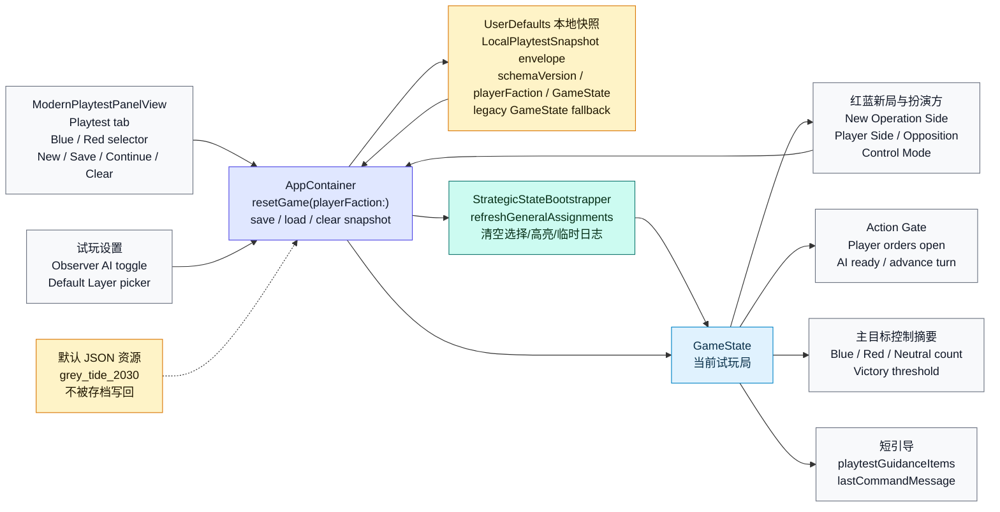

## 0.12 v6.10 发布候选准备

这张图描述当前 v6.10 收口项。发布候选准备只处理玩家可见命名、残留扫描、证据矩阵和发布前验证清单，不改变命令执行权威。

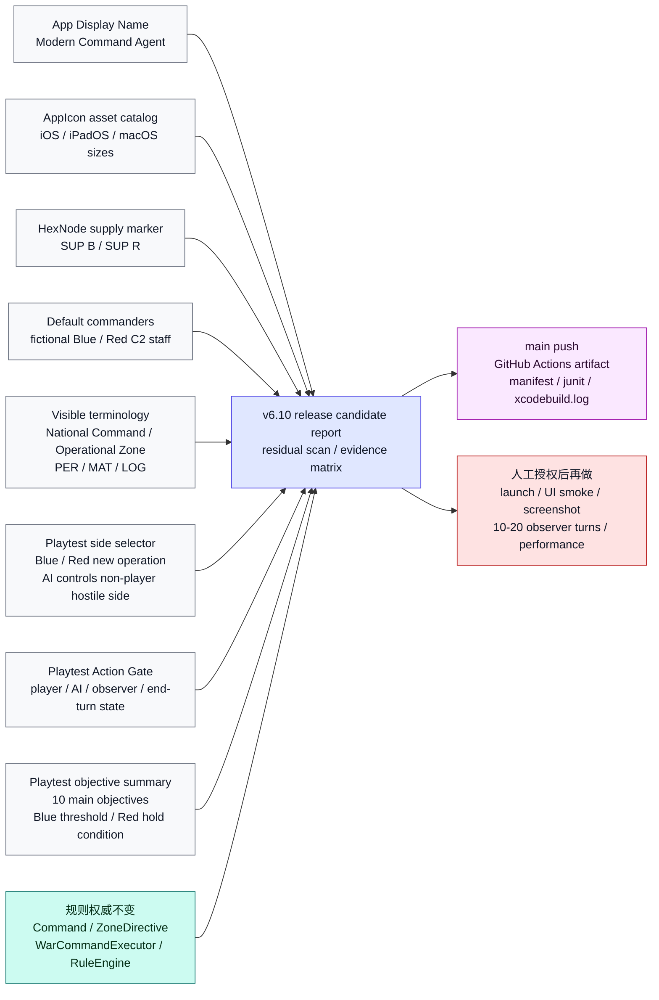

## 1. 总主线：从地图数据到游戏行动

这张图看全局。左上是地图数据怎么进入游戏；中间是 hex、region、theater、front、deploy 的分层关系；右侧是玩家/AI 命令如何统一进入规则系统；底部是 UI 和日志怎么读取结果。

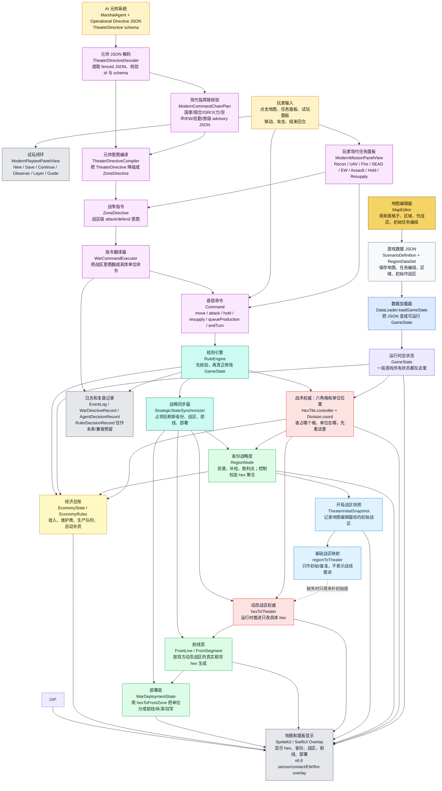

## 2. 占领与动态推进：一个单位移动后发生什么

这张图只看最容易出 bug 的链路：单位移动到敌控空格后，游戏如何占领这个 hex，并且只推进这个 hex 的动态战区和部署归属。

核心原则：占一个 hex，只改这个 hex 的 `hexToTheater` / `hexToFrontZone`；不能把整个 region 的 `regionToTheater` 改掉。

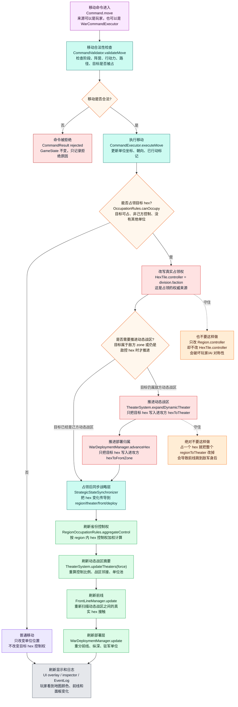

## 3. v0.8 经济、生产与补员链路

这张图看 v0.8 初级经济。经济总账是 faction 级资源池，但收入和部署资格仍回到真实 hex 控制和 region 聚合；生产命令仍走 `RuleEngine`，UI 不直接改 `GameState`。

```mermaid
flowchart TD
    BOOT["经济启动补账<br/>EconomyRules.bootstrapIfNeeded<br/>旧状态缺 economyState 时从地图推导账本"]:::economy
    HEX["真实控制权<br/>HexTile.controller<br/>经济收入必须有己方控制 hex 证据"]:::authority
    REGION["战略聚合<br/>RegionNode<br/>city / factories / infrastructure / supplyValue"]:::derived
    INCOME["收入计算<br/>EconomyRules.income<br/>manpower / industry / supplies"]:::economy
    LEDGER["阵营总账<br/>FactionEconomyLedger<br/>库存、上回合收入、维护费、补员消耗、队列"]:::economy

    UI["经济面板<br/>EconomyPanelView<br/>展示资源和生产按钮"]:::ui
    QUEUE["生产命令<br/>Command.queueProduction<br/>玩家/未来 AI 共用底层命令"]:::command
    VALIDATE["生产校验<br/>CommandValidator.validateProduction<br/>检查 phase 与资源是否足够"]:::rules
    PAY["预付成本并入队<br/>EconomyRules.queueProduction<br/>扣 PER/MAT/LOG，追加 ProductionOrder"]:::economy

    END["结束当前阵营回合<br/>Command.endTurn<br/>CommandExecutor.executeEndTurn"]:::command
    SUPPLY["补给状态刷新<br/>SupplyRules.updateSupplyStates"]:::rules
    RESOLVE["经济结算<br/>EconomyRules.resolveFactionTurn<br/>收入、维护费、短缺、补员、生产推进"]:::economy
    SHORT{"补给库存够吗?"}:::decision
    LOW["战略补给短缺<br/>supplied 单位降为 lowSupply"]:::rules
    REINF["自动补员<br/>安全后方 supplied 非敌邻单位<br/>每回合最多 +2 strength"]:::rules
    PROD["推进生产队列<br/>remainingTurns - 1<br/>ready 后部署或发补给箱"]:::economy
    DEPLOY{"有合格后方部署点吗?"}:::decision
    SPAWN["部署新单位<br/>首都/城镇/工厂/高基建/高补给或 supply source<br/>必须己控、空置、非敌邻"]:::rules
    WAIT["保留订单<br/>本回合无安全 hex，等待后续回合"]:::economy
    NEXT["切换阵营并刷新运行时层<br/>StrategicStateBootstrapper.refreshRuntimeState"]:::rules

    BOOT --> LEDGER
    HEX --> REGION --> INCOME --> LEDGER
    UI --> QUEUE --> VALIDATE --> PAY --> LEDGER
    END --> SUPPLY --> RESOLVE
    LEDGER --> RESOLVE
    RESOLVE --> SHORT
    SHORT -->|不足| LOW --> REINF
    SHORT -->|足够| REINF
    REINF --> PROD --> DEPLOY
    DEPLOY -->|有| SPAWN --> NEXT
    DEPLOY -->|没有| WAIT --> NEXT
    RESOLVE --> LEDGER

    WARN["边界<br/>经济系统不能直接占 hex<br/>也不能把中立/空控制 region 收入算给某阵营"]:::warn
    HEX -.守住.-> WARN
    VALIDATE -.守住.-> WARN

    classDef authority fill:#fee2e2,stroke:#dc2626,color:#111827
    classDef derived fill:#dcfce7,stroke:#16a34a,color:#052e16
    classDef economy fill:#fef9c3,stroke:#ca8a04,color:#292107
    classDef command fill:#fae8ff,stroke:#a21caf,color:#2a0a2f
    classDef rules fill:#ccfbf1,stroke:#0f766e,color:#042f2e
    classDef decision fill:#fff7ed,stroke:#ea580c,color:#1f1300
    classDef ui fill:#e5e7eb,stroke:#4b5563,color:#111827
    classDef warn fill:#ffedd5,stroke:#f97316,color:#431407
```

## 4. AI / 元帅决策链：AI 怎么下命令

这张图看 v6.10 当前默认 AI 主路径。AI 不直接控制单位，也不直接改地图；元帅先读取降维战场摘要，模拟 LLM 输出 `TheaterDirectiveEnvelope` JSON，经 decoder 校验后进入 `ModernCommandChain` advisory 复盘，再由 compiler 降级成战区级 `DirectiveEnvelope`。`WarCommandExecutor` 再把这些战术翻译成底层 `Command`，最后交给 `RuleEngine`。

当前默认 AI 主线是 `MarshalAgent -> Operational Directive JSON (TheaterDirective schema) -> TheaterDirectiveDecoder -> ModernCommandChain advisory JSON -> TheaterDirectiveCompiler -> ZoneDirective -> WarCommandExecutor -> RuleEngine`。旧 v0.37 `TheaterCommanderPool -> ZoneCommanderAgent` 作为 fallback 和显式 `.zoneDirective` 路径保留。统治者层只作为后续上游预留，当前不在主链路调用。旧 Agent D 管线仍保留，但默认不走。

```mermaid
flowchart TD
    START["触发 AI 行动<br/>AppContainer.advanceOrRunAI / runAIIfNeeded<br/>玩家点下一回合，或命令后轮到 AI"]:::input
    CHECK{"当前阵营该由 AI 控制吗?<br/>非玩家敌对方可跑；observer 可接管玩家方"}:::decision
    STOP["不运行 AI<br/>等待玩家操作或阶段切换"]:::stop
    REFRESH["行动前刷新运行时战略层<br/>StrategicStateBootstrapper.refreshRuntimeState<br/>避免 AI 读到旧前线/旧部署"]:::rules
    TM["AI 回合编排器<br/>TurnManager.runAITurn<br/>默认 pipelineMode = marshalDirective"]:::rules
    SUM["战场摘要<br/>MarshalBattlefieldSummarizer<br/>只给元帅 front/deploy/目标/补给摘要，不给全量 hex"]:::ai
    LLM["模拟 LLM 客户端<br/>SimulatedMarshalLLMClient<br/>输出 fenced JSON，不接真实网络或模型"]:::ai
    DEC["元帅 JSON 解码器<br/>TheaterDirectiveDecoder<br/>提取 JSON、解码、校验 schema/zone/region/tactic"]:::command
    MCHAIN["现代指挥链 advisory<br/>ModernCommandChainOrchestrator / Decoder<br/>校验并记录 ISR/Fires/Air/EW/Logistics/Brigade 子任务"]:::command
    COMP["元帅意图编译器<br/>TheaterDirectiveCompiler<br/>TheaterDirective -> ZoneDirective<br/>传递 focus/convergence/coordinated 参数"]:::command
    ENV["指令信封<br/>DirectiveEnvelope<br/>收集编译后的 ZoneDirective"]:::command
    TACTIC["高级战术路由<br/>TacticName<br/>blitzkrieg / spearhead / breakthrough / pincer / fire / feint / guerrilla / elastic / depth / lastStand"]:::command
    WCE["指令执行器<br/>WarCommandExecutor.execute<br/>按战术 profile 选择单位、目标和 fallback"]:::command
    BOTTOM["具体单位命令<br/>Command<br/>attack / move / hold / allowRetreat"]:::command
    RE["统一规则校验执行<br/>RuleEngine<br/>AI 和玩家共用同一套规则"]:::rules
    RECORD["指令复盘记录<br/>WarDirectiveRecord<br/>记录 tactic、target、结果、拒绝原因"]:::ui
    END["AI 自动结束回合<br/>RuleEngine.execute(.endTurn)<br/>切换 activeFaction / phase"]:::rules

    START --> CHECK
    CHECK -->|否| STOP
    CHECK -->|是| REFRESH --> TM --> SUM --> LLM --> DEC --> MCHAIN --> COMP --> ENV
    ENV --> TACTIC --> WCE --> BOTTOM --> RE --> RECORD --> END

    FALLBACK["Fallback 将军池<br/>TheaterCommanderPool + ZoneCommanderAgent<br/>元帅 JSON 无效或某 zone 无指令时使用"]:::ai
    DEC -.解码失败.-> FALLBACK --> ENV
    COMP -.zone 缺指令.-> FALLBACK

    LEGACY["旧 Agent D 管线<br/>AgentContext -> DecisionProvider -> AgentCommandMapper<br/>只在 legacyAgentOrder 显式分支或测试中使用"]:::legacy
    TM -.默认不走.-> LEGACY

    MANUAL["手写战区指令<br/>手工 ZoneDirective<br/>玩家聊天命令也可以直接指定 tactic/focus/convergence"]:::input
    MANUAL --> TACTIC

    classDef input fill:#fef3c7,stroke:#d97706,color:#1f1600
    classDef decision fill:#fff7ed,stroke:#ea580c,color:#1f1300
    classDef stop fill:#fee2e2,stroke:#b91c1c,color:#111827
    classDef rules fill:#ccfbf1,stroke:#0f766e,color:#042f2e
    classDef ai fill:#e0e7ff,stroke:#4f46e5,color:#111827
    classDef command fill:#fae8ff,stroke:#a21caf,color:#2a0a2f
    classDef ui fill:#e5e7eb,stroke:#4b5563,color:#111827
    classDef legacy fill:#f3f4f6,stroke:#6b7280,stroke-dasharray:5 5,color:#111827
```

## 5. MapEditor 到游戏数据：地图怎么进入主游戏

这张图看地图编辑器的输出链路。编辑器里画的是初始地图和初始战区；运行时动态战区仍由游戏里的 `hexToTheater` 推进，不是编辑器脚本控制。

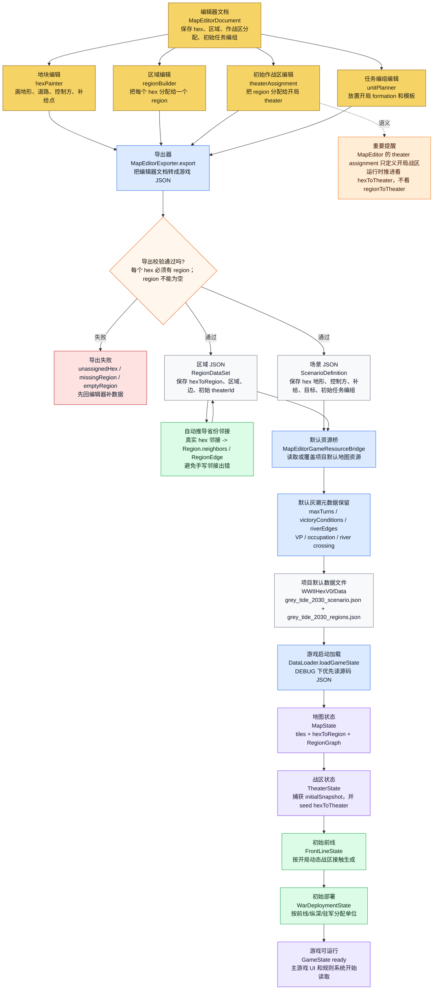

## 6. v1.1 主游戏 macOS 入口

这张图只说明 v1.1 新增的 macOS 主游戏 target。它复用主游戏数据、UI、SpriteKit 棋盘和规则系统；macOS 输入只是平台桥接，不是新的规则入口。

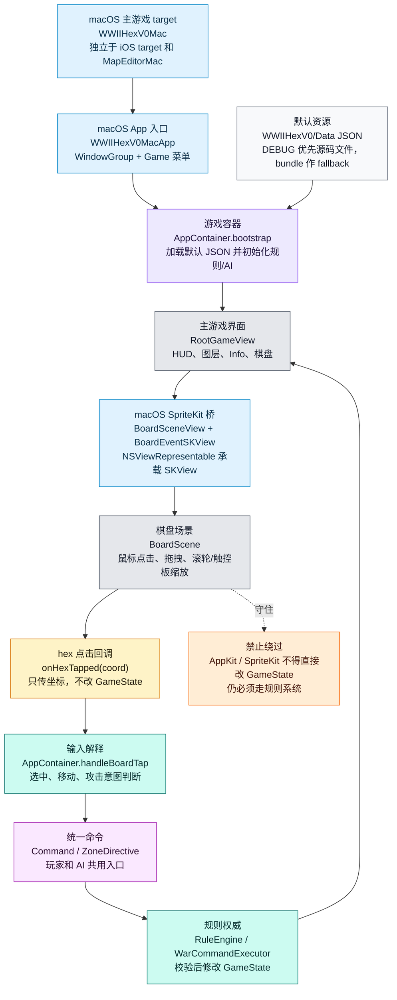

## 7. v1.0 UI / AI / 初版试玩链路

这张图说明 v1.0 分支的收口点：它不新增规则入口，只改善 UI 可读性、AI 回放、轻量性能和试玩记录。

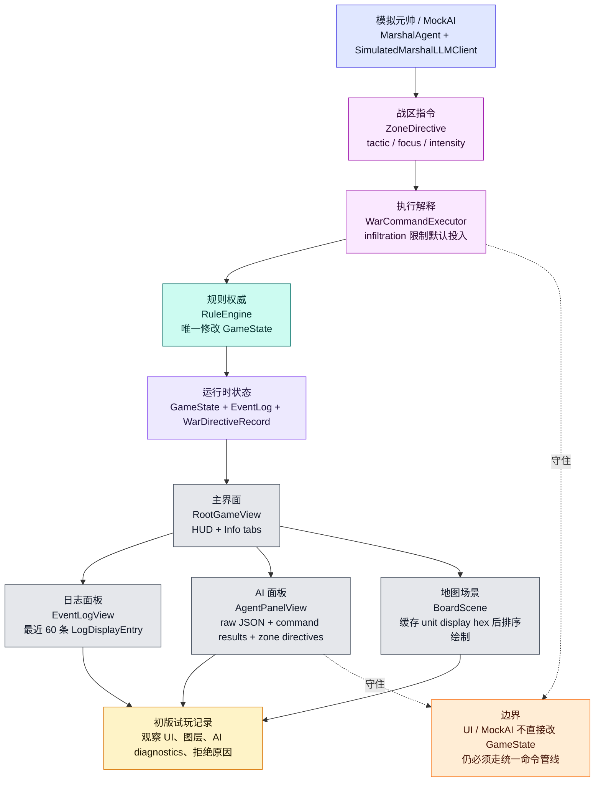

## 8. Commander 与玩家双轨命令

这张图说明当前兼容主线：实体 commander 从 JSON / region 种子接入 FrontZone；玩家可以微操具体 formation，也可以通过 Commander Cell 发作战区宏观命令。两条路最终仍收口到规则系统。

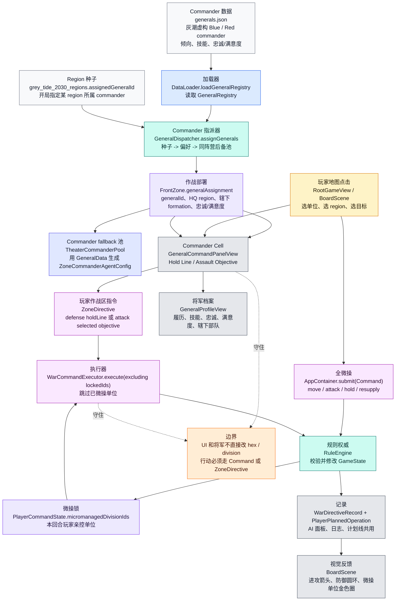
